<div align="center">
  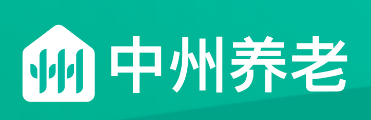


<h1 >中州养老院管理系统</h1>
<h5>**中州养老院** 是一个基于 Spring Boot 的智慧养老综合管理系统，涵盖入住管理、服务记录、财务管理、家属端交互等多个核心业务模块。</h5>
  <a href="https://www.oracle.com/java/technologies/javase-jdk11-downloads.html"></a>
  <a href="https://spring.io/projects/spring-boot"></a>
  <a href="https://projectlombok.org/"></a>
  <a href="https://mybatis.plus/"></a>
  <a href="https://github.com/alibaba/druid"></a>
  <a href="https://github.com/alibaba/fastjson"></a>
  <a href="https://jwt.io/"></a>
  <a href="https://vuejs.org/"></a>
  <a href="https://www.typescriptlang.org/"></a>
  <a href="https://tdesign.tencent.com/starter/vue/"></a>
  <a href="https://github.com/redisson/redisson"></a>
  <a href="http://www.xuxueli.com/xxl-job/"></a>
  <a href="https://orika-mapper.github.io/orika-docs/"></a>
</div>

---

### 📌 **项目入口**

| 类型 | 地址 |
|------|------|
| 前端工程代码 | [zzyl-web](https://gitee.com/itxinfei/zzyl-web) |
| 后台管理系统 | [中州养老院后台管理](https://zhyl-admin.itheima.net/#/dashboard/base) |
| 项目原型地址 | [原型系统](https://rp-java.itheima.net/zhyl/) |

---


## 一、项目介绍

中州养老院是一家致力于为老年人提供高质量养老服务的专业机构。拥有着多年的行业经验和深厚的服务实力，一直秉持着“以人为本、关爱生命”的核心理念，始终致力于为老年人提供最优质的养老服务，为晚年生活注入更多的快乐与温暖。

中州养老院坐落在一片幽静的绿树成荫的区域，占地面积超过30,000平方米，总建筑面积为40,000平方米。经过多年的发展，中州养老院成长为一家床位数量众多、服务项目丰富的养老机构，现有床位超过800张，员工人数达到200余人。该养老院为老年人提供舒适的住宿环境，房间宽敞明亮，家具精美，充满温馨和舒适感。床铺舒适柔软，提供优质的床垫和床上用品，确保老年人的良好睡眠。同时中州养老院注重细节，为老年人提供贴心、周到的服务。中州养老院员工经过专业培训，拥有高素质的服务意识和服务技能。他们时刻以老年人的需求和舒适为重，热情友好，愿意倾听老年人的心声，为老年人提供贴心、专业的服务和关怀。

中州养老院不断地推进创新，为老人提供更加优质的服务。还还获得了多项荣誉，包括“全国优秀养老院”、“山区老年人关爱先进集体”等。这些荣誉的获得证明了中州在养老服务领域中的领先地位，同时也是中州养老院不断努力的动力。

### 1 行业背景

中国老龄化程度加深，我国老龄事业和养老服务体系的发展得到了国家的高度重视，在国家政策的支持下，我国智慧养老产业主体持续增多，产业链不断整合，发展前景较好。我国正在形成一个多元化“互联网+养老”的智慧老年护理服务系统，智慧养老是我国的必然趋势

**市场规模及预测**

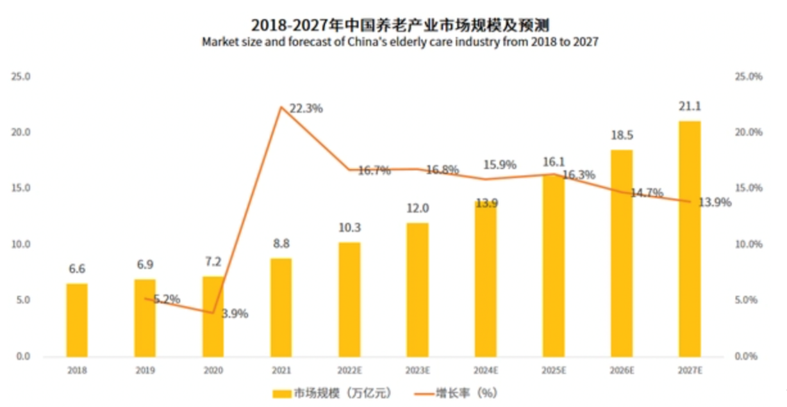

- 2022年中国养老产业市场规模达到10.3万亿元，同比增长16.7%。

- 预计2023-2027年中国养老产业迎来较快速增长。预计2027年中国养老产业市场规模达21.1万亿元

### 2 整体业务流程

中州养老系统为养老院量身定制开发专业的养老管理软件产品；涵盖来访管理、入退管理、在住管理、服务管理、财务管理等功能模块，涉及从来访参观到退住办理的完整流程。

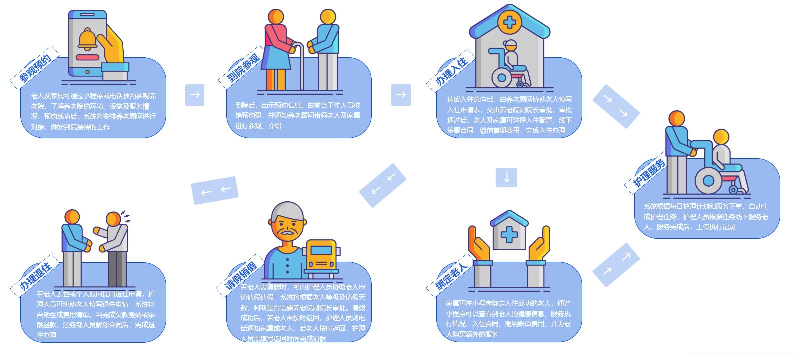

### 3 系统架构

项目原型地址：https://rp-java.itheima.net/zhyl/

中州养老项目分为两端，一个是管理后台，另外一个是家属端

- 管理后台：养老院员工使用，入住、退住，给老人服务记录等等
- 家属端：养老院的老人家属使用，查看老人信息，缴费，下订单等等

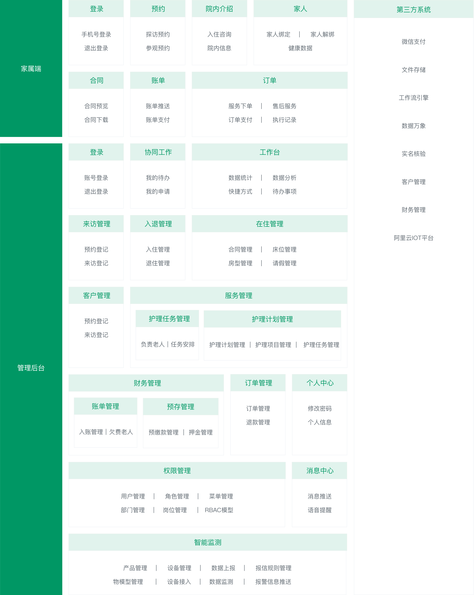

### 4 技术架构

下图展现了中州养老项目主要使用的技术：

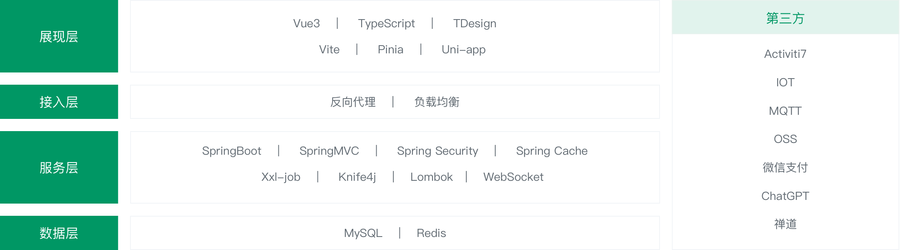

## 二、项目管理

在讲解项目之前，我们有必要去熟悉一下开发软件的一些基础理论和物料，这样可以使我们更快的熟悉软件的开发的节奏，并熟知我们的核心任务及在团队中的角色分工。主要包含了以下几个部分

- 项目生命周期
- 项目开发模式
- 项目管理
- 项目中产生的文档
- 后端人员开发流程

### 1 项目生命周期

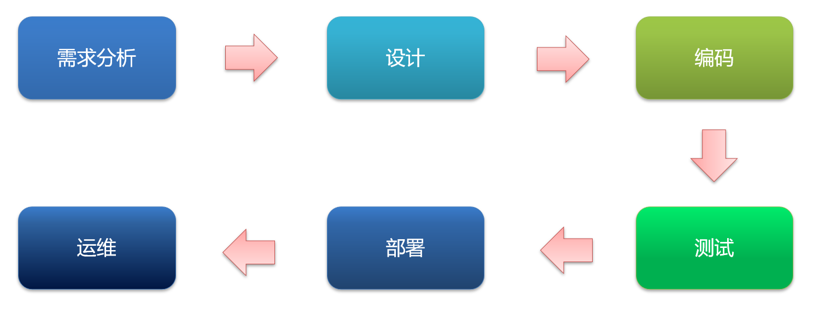

1. 需求分析：在这个阶段，开发团队需要与客户或业务代表沟通，了解软件的功能和性能需求，以及用户的需求和期望。这个阶段的目的是确保开发团队理解软件的需求，并能够为之制定开发计划。

2. 设计：在这个阶段，开发团队需要根据需求分析结果，设计软件的架构和模块，制定开发计划。设计阶段的目的是确保软件的架构和模块能够满足软件需求，并且能够支持软件的可维护性和可扩展性。

3. 编码：在这个阶段，开发团队需要根据设计文档，编写软件代码。编码阶段的目的是将设计文档转化为可执行的软件代码，并确保代码的质量和可读性。

4. 测试：在这个阶段，开发团队需要对软件进行测试，包括单元测试、集成测试、系统测试、验收测试等。测试阶段的目的是发现并修复软件中存在的缺陷和错误，并确保软件能够满足需求和期望。

5. 部署：在这个阶段，开发团队需要将软件部署到生产环境中，确保软件能够正常运行。部署阶段的目的是确保软件能够在实际环境中运行，并能够满足用户的需求和期望。

6. 运维：在这个阶段，开发团队需要对软件进行维护和更新，确保软件一直能够满足用户的需求和期望。运维阶段的目的是确保软件能够持续地运行，并能够满足用户的不断变化的需求和期望。

### 2 项目开发模式

#### 2.1 瀑布模型（Waterfall Model）

瀑布模型是一种顺序型开发模式，各个阶段按照顺序依次进行，每个阶段完成后才能进入下一个阶段。这种模式适用于需求稳定、开发周期长的项目。

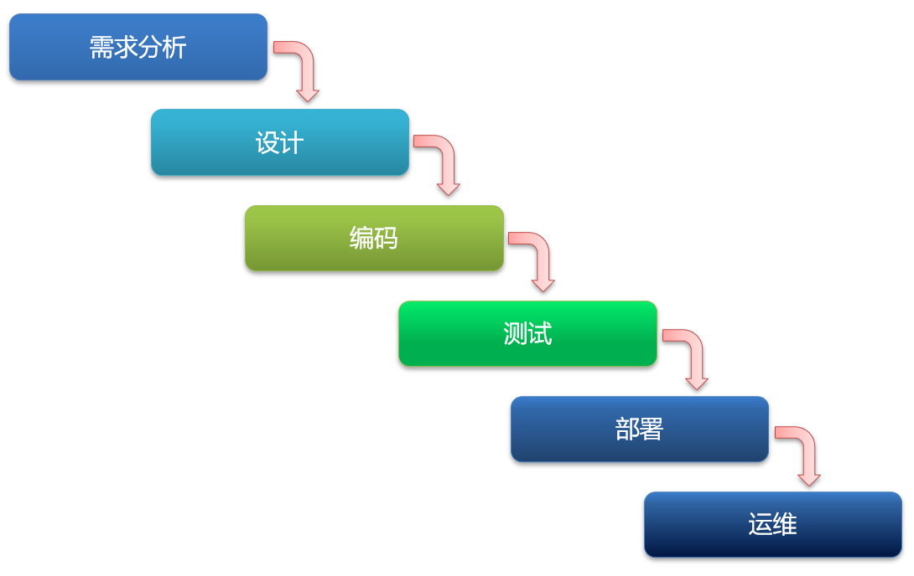


#### 2.2 敏捷开发（Agile Development）

敏捷开发是一种迭代型开发模式，强调团队合作、用户参与和快速响应变化。敏捷开发方法包括Scrum、XP、Lean等，适用于需求不稳定、开发周期较短的项目。

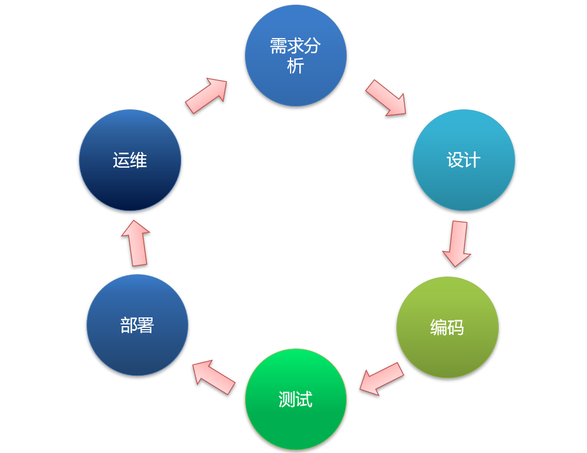

- DevOps

DevOps是一种将开发和运维流程整合在一起的开发模式，强调自动化和持续交付。DevOps适用于需要频繁部署和更新的项目。

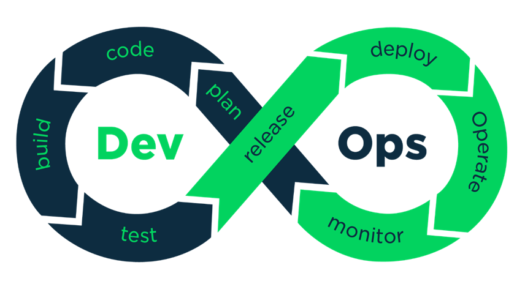


**三者对比**：

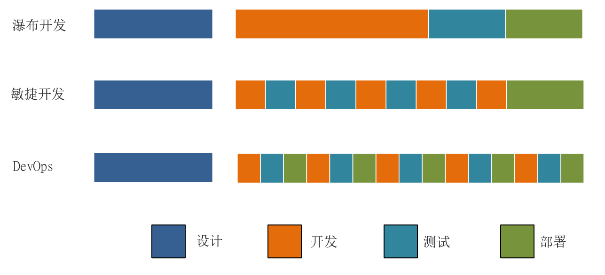

### 3.3 项目管理

#### 3.1 进度管理

1. 制定计划：在软件开发开始之前，制定开发计划和时间表，确定每个阶段的工作内容和时间节点。计划的制定需要考虑到人力、物力、时间等资源的限制，并充分考虑风险和变更管理。

2. 监控进度：在软件开发过程中，要对项目进度进行监控和控制，及时发现和处理进度偏差和问题。可以通过制定里程碑、进度报告、进度会议等方式来监控项目进度。

3. 管理风险：软件开发中存在各种风险，如需求变更、技术难点、人员流失等。需要及时识别和管理这些风险，制定应对措施，以避免对项目进度的负面影响。

4. 优化流程：软件开发是一个复杂的过程，需要不断优化流程，提高效率和质量。可以采用持续集成、自动化测试、代码审查等方式来优化流程，提高开发效率和质量。

5. 管理变更：在软件开发过程中，会出现各种变更，如需求变更、技术方案变更等。需要对变更进行管理，确保变更的合理性和影响范围，并及时更新计划和时间表。

#### 3.2 缺陷管理

1. 发现和记录：在软件测试过程中，测试人员会发现各种缺陷和问题，需要及时记录并分类。记录缺陷时，需要包括缺陷的描述、复现步骤、环境信息等详细信息。

2. 筛选和分析：对于发现的缺陷，需要根据优先级和严重程度进行筛选和分析，确定哪些缺陷需要优先处理。在分析缺陷时，需要考虑到缺陷的根本原因，并制定相应的修复方案。

3. 分配和跟踪：将已筛选的缺陷分配给相应的开发人员进行修复，并跟踪修复进度和状态。在跟踪缺陷时，需要及时更新缺陷状态、处理进度、修复时间等信息。

4. 验证和关闭：在开发人员完成缺陷修复后，需要进行验证测试，确保缺陷已经被修复。如果验证测试通过，则可以将缺陷关闭。如果验证测试失败，则需要重新分配给开发人员进行修复。

5. 统计和分析：对于已关闭的缺陷，需要进行统计和分析，了解缺陷的类型、数量、分布情况等信息。通过对缺陷统计和分析，可以发现软件开发中的问题和瓶颈，并采取相应的措施进行优化。

#### 3.3 代码规范

在软件开发中，代码规范是非常重要的，可以提高代码的可读性、可维护性和可扩展性。以下是一些常见的代码规范：

1. 命名规范：变量、函数、类等命名要具有清晰明了的含义，使用驼峰式命名法。避免使用缩写或简写，除非是广泛使用的术语。

2. 缩进和空格：代码缩进要保持一致，通常使用四个空格或一个制表符。运算符和关键字周围要留有空格，但是在括号内不需要。

3. 注释规范：注释要清晰明了，描述代码的作用、逻辑和实现细节。注释应该写在代码上方，而不是行末。代码中应该尽可能地减少注释，让代码本身尽可能地自解释。

4. 函数规范：函数应该尽可能地短小精悍，每个函数只做一件事情。函数的参数应该尽可能地少，最好不要超过三个。函数应该有明确的返回值类型和返回值。

5. 异常处理规范：在代码中应该尽可能地处理异常情况，避免程序崩溃或出现不可预知的行为。异常处理应该具有清晰明了的逻辑和错误提示信息。

## 四、文档介绍

### 4.1 原型+PRD

程序员开发重要依据！！！

PRD：Product Requirements Document 产品需求文档

### 4.2 UIUE

UIUE是：用户界面体验

UI角色（User Interface，用户界面）主要负责为用户提供与程序交互的界面。UI是用户与系统之间的桥梁，它涵盖了用户在使用软件时所看到和操作的所有元素。

UE角色（User Experience）：用户体验设计师，就是管产品好不好用，是不是人性化。


UI角色（User Interface，用户界面）主要负责为用户提供与程序交互的界面。UI是用户与系统之间的桥梁，它涵盖了用户在使用软件时所看到和操作的所有元素

1. **界面设计（Interface Design）**：UI角色负责设计用户界面的外观和布局。这包括选择颜色、字体、图标、按钮样式等元素，以及整体界面的组织和结构。目标是使界面简洁、直观、易于理解和使用。
2. **用户体验设计（User Experience Design）**：UI角色关注用户在使用软件时的感受和体验。他们致力于确保用户界面是用户友好的，用户能够轻松完成任务，同时尽量减少用户遇到的困难和挑战。
3. **原型设计和交互设计（Prototyping and Interaction Design）**：在开发软件之前，UI角色通常会创建原型，这是界面的初步模型，用于演示和测试界面的功能和流程。交互设计关注用户如何与界面元素进行交互，例如按钮点击、菜单选择等。
4. **图形设计（Graphic Design）**：UI角色负责创建和选择界面中使用的图形元素，例如图标、图片、背景等。这些图形元素不仅要美观，还要在视觉上与界面的整体风格和主题相匹配。
5. **移动设备适配（Mobile Responsiveness）**：对于移动应用程序或响应式网页，UI角色需要确保界面在不同尺寸的移动设备上都能正确地显示和操作，以提供一致的用户体验。
6. **多平台支持（Cross-Platform Support）**：UI角色还需要考虑在不同操作系统和设备上的界面兼容性，确保软件可以在不同平台上运行并保持一致性。
7. **可访问性（Accessibility）**：UI角色要关注那些可能有特殊需求的用户，确保他们也能够方便地使用软件。这可能包括为视觉障碍用户提供屏幕阅读器支持，或为身体障碍用户提供键盘导航方式。
8. **与开发团队的协作**：UI角色通常需要与开发团队密切合作，确保设计的可实现性，并在开发过程中进行必要的调整和优化。

总的来说，UI角色在软件开发过程中发挥着至关重要的作用，他们不仅要关注界面的外观，还要确保用户能够轻松、愉快地与软件进行交互，从而提升用户体验和满意度。

#### 4.3 个人开发计划

- 需求分析设计
- 编码自测
- 接口联调

## 五、代码结构

在提供的代码中，已经有了很多的基础类和业务类，我们一起来看一下

1. 工程结构

   ```json
   ├── zzyl                              
   │   ├── zzyl-common    //通用的模块，比如，统一的异常、工具类、常量等等
   │   ├── zzyl-framework   //框架核心类，比如，配置类、公共的拦截器等
   │   ├── zzyl-pay         //支付组件，目前对接微信扫码支付功能
   │   ├── zzyl-security    //安全组件，权限所有功能在这里实现
   │   ├── zzyl-service     //业务层，编写业务层代码
   │   ├── zzyl-web         //控制层，对外提供接口
   ```

   我们先来熟悉下common、framework、service、web模块，这些都与我们的业务开发息息相关，后期我们会再详细讲解pay、security模块。

2. zzyl-common模块

   ```json
   ├── com.zzyl                              
   │   ├── base
   │   │   ├── AjaxResult    //通用的接口返回结果类
   │   │   ├── BaseDto       //基础的DTO，所有自定义的DTO都继承它
   │   │   ├── BaseEntity    //基础的实体类，所有自定义的实体类都继承它
   │   │   ├── BaseVo        //基础的VO，所有自定义的VO都继承它
   │   │   ├── IBasicEnum    //公共的枚举类
   │   │   ├── PageResponse  //分页列表使用该对象封装       
   │   ├── constants         //这个包下存储所有的自定义常量类
   │   ├── enums             
   │   │   ├── BasicEnum     //基础枚举
   │   ├── exception         //公用异常包
   │   │   ├── BaseException  //基础异常类
   │   │   ├── GlobalExceptionHandler  //全局异常处理器
   │   ├── utils   //工具类包
   │   ├── vo      //公共的vo包
   ```

   > DTO（Data Transfer Object）据传输对象，主要用于外部接口参数传递封装，接口与接口进行传递使用
   >
   > VO（Value Object）视图对象，主要用于给前端返回页面参数使用

3. zzyl-framework模块

   ```json
   ├── com.zzyl                              
   │   ├── config
   │   │   ├── OssAliyunAutoConfig    //阿里OSS配置类
   │   │   ├── OSSAliyunFileStorageService    //OSS上传、删除接口封装
   │   │   ├── MybatisConfig       //mybatis自定义拦截器
   │   │   ├── SwaggerConfig    //swagger配置类，在线接口
   │   │   ├── WebMvcConfig        //mvc配置类，拦截器、映射器等
   │   ├── intercept             
   │   │   ├── AutoFillInterceptor     //自动填充字段拦截器
   │   ├── properties         
   │   │   ├── AliOssConfigProperties  //阿里OSS配置读取
   │   │   ├── JwtTokenManagerProperties  //JWT配置读取
   │   │   ├── SwaggerConfigProperties  //Swagger配置读取
   ```

4. zzyl-service模块

   ```json
   java
   ├── com.lunckon                              
   │   ├── dto   
   │   ├── entity             
   │   ├── enums  
   │   ├── mapper
   │   ├── service             
   │   ├── vo  
   resouces
   ├── mapper
   │   ├── xxxxx.xml
   ```

5. zzyl-web模块

   ```json
   java
   ├── com.lunckon                              
   │   ├── controller   
   │   │   ├── XxxController
   │   ├── zzylApplication  
   resouces
   ├── application.yml
   ├── logback.xml
   ```
### 4.3 前端环境搭建及运行

#### 4.3.1 前端环境

- node-v16.20.0  (强制)

  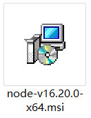

- Vue 3

- TypeScript

- 开发工具：vscode

- 前端vue组件：TDesign

#### 4.3.2 代码运行

1. 代码导入

   在代码文件夹中找到’前端完整代码’，拷贝到一个没有中文的目录，然后使用vs code打开

   

   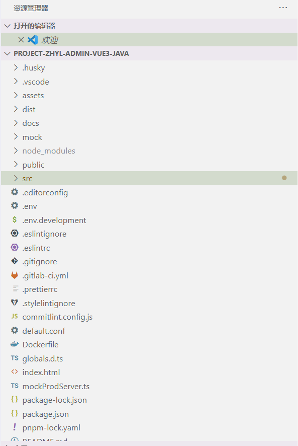

3. 安装运行

   ```bash
   ## 安装依赖
   npm install 
   
   ## 启动项目 
   npm run dev
   
   ## 构建正式环境 - 打包
   npm run build
   ```

### 4.4 启动前后端项目

在浏览器中输入网址，在前端项目启动之后的控制台，会提示访问的地址是什么，效果如下：

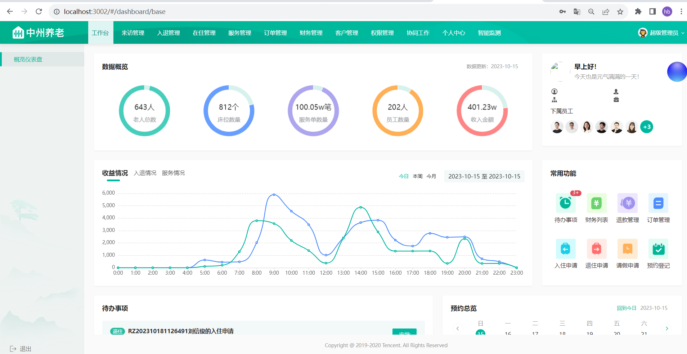

## 5 护理项目功能开发

在开发具体的功能之前，我们来回顾一下刚才讲过的后端开发流程

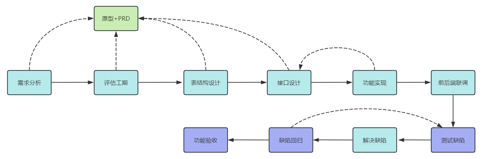

其中，模块开发最耗时的是设计阶段，包含了需求分析、评估工期、表结构设计、接口设计这几部分

如果这几步我们都能顺利完成，那么功能开发（代码），就水到渠成了

### 5.1 需求分析

需求分析，该如何入手呢？

入手的基本思路就是原型文档和PRD文档，有了这两个文档，我们就有了很重要的开发依据

>注意：在实际开发中，有了新需求以后，产品经理会先给项目组的成员开会，来评审新的需求，在会议中，如果有任何不理解的需求，要及时提出来，方便后期设计、开发


